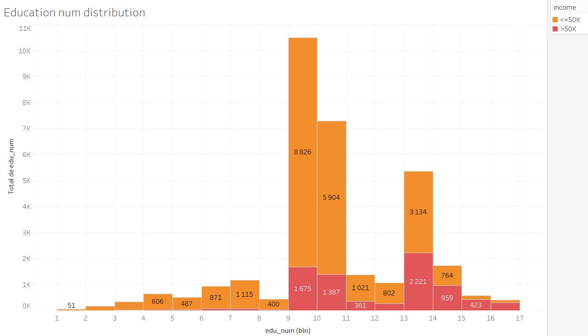

# <center> NaiveBayesianClassifier </center>

Implementation of a Naive Bayesian Classifier for the Census Income or Adult dataset (http://archive.ics.uci.edu/ml/datasets/Adult)

Prediction task is to __determine whether a person makes over 50K a year__.

## How to run it ?

You will need to install :
- python3
- pandas
- numpy
- seaborn
- matplotlib
- sklearn

To install Python 3 and the dependencies:
```script
sudo apt install python3.6
sudo apt install python3-pip
pip3 install numpy pandas seaborn matplotlib sklearn
```


Commande line to run :
```script
python test.py
```

## Data visualization

Here is some exemples of variables visualization. To see all the visualisations look at the file `adult_analysis.twb`.

<center></center>
<center></center>
<center></center>
<center></center>
<center></center>

From thoses visualisations we can first see that the dataset is not well balanced.  
We can also se that some variable like 'age' and 'fnlwgt' looks not very informative (proportionality between the number of occurence per bin and the 2 class labels) and other like 'occupation' and 'hours_per_week' looks more interesting.

## Data preprocessing

All the preprocessing steps are made by the `Preprocessor` class in `preprocessor.py`


### Missing values  
This dataset contain missing values so I implemented 2 diffrent methods to deal with them:
- __Remove__ : if their is a missing value, we just remove the entire row
- __Average/most frequent__ : if their is a missing value, we replace it with the mean value of the column if it's a continous value or with the most frequent value in the column if it's a categorical data.  

You can choose between this 2 options when you create the preprocessor in `test.py`:
```Python
preprocessor = Precessor(missing_value_method="remove")
or
preprocessor = Precessor(missing_value_method="average")
```

### Continuous data
A other problem with the adult dataset is that it contains continous values whitch is a problem to use the Naive Bayes algorithm.  
To deal with thoses continuous values I used the equal-width binning with the most relevant bin I found during my data visualization step using Tableau.  
The bins I used :

| Continuous attribute | Size of the bin |
|----------------------|:---------------:|
| age                  | 5               |
| fnlwgt               | 22500           |
| hours-per-week       | 5               |

You can easly change those value by changing the `column2Descrtize` dictionary in `Preprocessor.process()`

## Naive Bayes

The Naive Bayes algorithm in implemented in the `NaiveBayes` class in `naiveBayes.py`.  
The algorithm use the conditional probability of each attribute knowing the label. All the probabilities `P(attribute=value | income='>50K')` and `P(attribute=value | income='<=50K')` are stored in the dictionary attribute `NaiveBayes.probabilities`.

## K-fold cross-Validation

The K-fold cross-validation is implemented in the method `NaiveBayes.Kfold_cross_validation()` in `naiveBayes.py`. It first divide the dataset into 2 part : test and training. The test set represent 20% of the dataset and will be used only at the end of the process. During the K-fold cross-validation we split the previous training set into 2 sub-set, training and validation. The final sub-set distribution is summarized in the following figure:


<center></center>


At each step of the K-fold cross-validation we randomly choose a Training set and a Validation set. We build the probability model of the Naive Bayes algorithm on the Training data and we evaluate this model on the Validation set. We repeat this K times and we average the results.  
At the end we used the Test to evaluate our model on data it never saw before.  

Sometimes during the K-fold K-fold cross-validation we have attribute value that are on the Test set but not on the Training set. To face the 0 probability issue we use Laplacian correction to compute none 0 probabilities.

## Results and Analysis

### Relevant attribute for classification

First we want to know if all the attribute we have in the dataset are relevant to predict the income. So for each attribute we tried to predict the income using only this attribute and we look at the accuracy. The results are listed in the following table:

| Attribute used for prediction | Accuracy |
|-------------------------------|:--------:|
| age                           | 59.67%   |
| workclass                     | 66.56%   |
| fnlwgt                        | 66.68%   |
| education                     | 71.95%   |
| education_num                 | 71.48%   |
| marital_status                | 71.08%   |
| occupation                    | 65.79%   |
| relationship                  | 71.33%   |
| race                          | 33.19%   |
| sex                           | 50.08%   |
| capital_gain                  | 79.37%   |
| capital_loss                  | 77.16%   |
| hours_per_week                | 70.09%   |
| native_country                | 29.18%   |

From thoses results we can see that some attribute, like sex and native_country, looks none relevant to predict incomes and can leads to misclassification. Some others, like capital_gain and capital_loss, are almost sufficient to predict incomes. Finally, some attribute, like sex, looks not very informative to classify incomes.

Those results confirm what the data visualization was telling us before.


### Classification results

All the results below are the results obtain with the 10-fold cross validation and not on the Test set. To compare, here are the metrics obtain using weka's Naive Bayes implementation.

| Metrics              | score  |
|----------------------|:------:|
| Good classification  | 83.25% |
| Bad classification   | 16.75% |
| Precision            | 0.822  |
| Recall               | 0.833  |
| F1                   | 0.822  |
| Matthews correlation | 0.502  |


Note that for the 4 last metrics Weka use a weighted average and I'm not sure it's comparable with our values. To have more comparable values we may use the simple averaged values. Those avereged values are : `Precision=0.783` `Recall=0.722` `F1=0.744` `Matthews correlation=0.502`


#### Are all attributes relevant ?
When we use all the attributes for the classification we obtain the following results:

| Metrics              | score  |
|----------------------|:------:|
| Good classification  | 79.76% |
| Bad classification   | 20.24% |
| Precision            | 0.876  |
| Recall               | 0.560  |
| F1                   | 0.683  |
| Matthews correlation | 0.574  |

As saw before the attribute 'race' and 'native_country' may not be relevant, so we tried without thoses attributes and we obtained :

| Metrics              | score  |
|----------------------|:------:|
| Good classification  | 80.64% |
| Bad classification   | 19.36% |
| Precision            | 0.874  |
| Recall               | 0.572  |
| F1                   | 0.692  |
| Matthews correlation | 0.586  |

We therefore observe that the results are a little better without these attributes. But we still below the results obtain using Weka.

#### Confusion matrix

<center></center>


#### Does the missing value methode impact the accuracy ?

We also tried several times with the 2 methods discussed before to deal with missing values and we didn't saw any difference on the accuracy.
